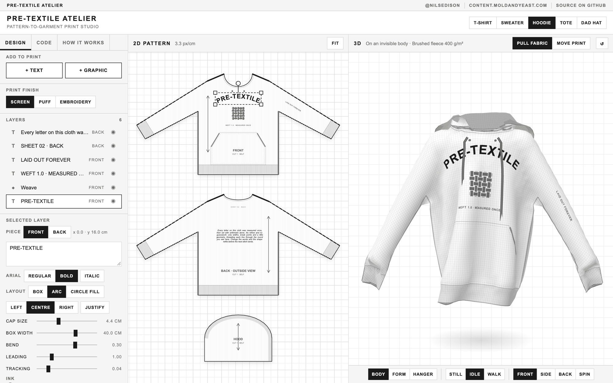

# Pre-Textile Atelier

A pattern-to-garment print studio in one HTML file. Set type and graphics on flat pattern pieces, and the browser cuts the cloth, sews the seams, prints the artwork into it and drapes it onto a body, a dress form or a hanger. None of it is a ready-made 3D model: every garment is built from its measurements each time you change something.

**Live: https://textile-atelier.moldandyeast.com**



More at https://content.moldandyeast.com · follow [@nilsedison](https://twitter.com/nilsedison) on Twitter · [source on GitHub](https://github.com/moldandyeast/pre-text-atelier).

## The studio

Three windows, drawn as a monochrome drafting room:

- **Object browser** (left). **Design** adds text and graphics, picks the print finish and lists the layers. **Code** holds the whole design as editable YAML. **How it works** walks through the pipeline with live counts from the running simulation.
- **2D Pattern** (centre). The flat pieces with seam lines, grain arrows and cut notes. Your print sits on the pieces here.
- **3D** (right). The garment, sewn and draped, with your print stretched and folded into the cloth.

**Products:** T-shirt, Sweater, Hoodie, Tote and Dad hat.
**Fabrics:** cotton jersey 180 g/m², merino knit 320 g/m², brushed fleece 400 g/m², cotton canvas 340 g/m² and washed cotton twill for the cap.
**Finishes:** screen print, puff and embroidery.
**Wear:** on a body (still, idle or walking), on a dress form, or on a hanger.

## Using it

| Where | Do | Result |
| --- | --- | --- |
| Pattern | Drag a layer | Move it on its piece |
| Pattern | Drag a corner handle | Scale it |
| Pattern | Drag the top handle | Rotate it. Hold Shift to snap to 15° |
| Pattern | Drag empty space · scroll | Pan · zoom |
| Pattern | Double-click a text layer | Edit its text |
| 3D, *Pull fabric* | Drag the cloth | Pull it, and it springs back |
| 3D, *Move print* | Drag a print | Slide it across the garment |
| 3D | Drag off the garment · scroll | Orbit · zoom |
| Anywhere | Arrow keys | Nudge the selected layer 0.5 cm (2 cm with Shift) |
| Anywhere | Delete or Backspace | Remove the selected layer |
| Anywhere | Drop an `.svg` file | Add it as a graphic |
| Code tab | Ctrl or ⌘ + Enter | Apply the YAML now |

Text layers lay out as a **box**, an **arc** or a **circle fill**, with size, width, bend, leading, tracking, alignment and justification. Graphics are six presets (Weave, Sun, Spool, Burst, Flower, Wave) or your own SVG, uploaded, pasted or dropped. Prints come out in greys, to match the look of the studio.

The design is kept in `localStorage`, so it is still there when you reload.

## Design as code

The **Code** tab is the whole design as YAML, and it stays in sync both ways. Edit it and the garment rebuilds. Drag something on the pattern or the garment and the YAML is rewritten. It comes with five examples: Studio hoodie, All-over tee, Cropped boxy tee, Market tote and Embroidered cap.

```yaml
product: tee
fabric: jersey
block:            # centimetres, optional
  chest: 31       # half chest
  length: 56
wear: body
motion: walk
finish: puff
print:
  front:
    - text: OFF THE GRID
      at: [0, 24]   # cm, x from the centre line
      size: 4.2     # type size in cm
      bold: true
      layout: arc
      bend: 0.3
    - graphic: star
      at: [0, 20]
      width: 3.2
      ink: "#c8c8c6"
      repeat: { gap: 2.4, offset: 0.5 }   # all-over
```

The full key reference is under **Reference** in the Code tab.

## How it works

Six steps, run again on every change:

1. **Cut the pattern.** Each block is drawn in centimetres from a few measurements: half chest, length, neck width and drop, sleeve angle, length and cuff. The outline is sampled on a 2.4 cm grid, and points outside it are snapped onto the edge, so the cloth edge follows the cut line. The cap's six gores and brim are unrolled from a dome, so the flat pieces match the curved ones.
2. **Sew the seams.** Front and back share their shoulder, sleeve and side lines, and matching grid points are joined by zero-length stitches. The stitches tighten over the first second, which is the drape you see on load.
3. **Set the type.** Text is laid out by **Weft**, the measuring code from Pre-Textile. It measures each word once with canvas, then breaks lines with plain arithmetic, so relaying out on every keystroke costs almost nothing.
4. **Print the atlas.** Every visible layer is drawn into one 2048 px texture, clipped to its piece. Each cloth node keeps the texture position of its spot on the pattern, so the print moves with the fabric.
5. **Drape the cloth.** Verlet integration with structural, shear and bending springs, plus the stitches. Rib bands are cut 20% short so cuffs and hems gather. The body is made of ellipsoids and jointed capsule arms, and structural threads can't stretch more than 6%. The cap is structured, so it is placed on its block instead of simulated.
6. **Shade it.** WebGL lights the cloth in 20 stepped grey tones, adds a thread every 8 mm and inks hems, ribs and stitching. Puff and embroidery read the edges of the print to raise it.

## Repository

| Path | What |
| --- | --- |
| `public/index.html` | The deployed piece. One file, no third-party requests, runs offline when saved to disk. Generated by `npm run build`, and committed. |
| `src/pre-textile-atelier.html` | The original piece, verbatim. |
| `src/credits.css`, `src/credits.html` | The credits bar, set in the piece's own type and hidden in fullscreen. |
| `build.mjs` | Writes `public/index.html` from the original with three splices: js-yaml inlined in place of its CDN `<script src>`, the credits CSS and the credits bar. The piece's own scripts are not touched. |
| `vendor/js-yaml/` | [js-yaml](https://github.com/nodeca/js-yaml) 4.1.0, `dist/js-yaml.min.js` from npm, with its MIT licence. |
| `wrangler.jsonc` | An assets-only Cloudflare Worker serving `public/` on the custom domain. No server code. |
| `docs/` | The README screenshot. Not deployed. |

The piece sets everything in the system Arial stack, so there is no webfont to ship.

## Build and run

```sh
npm install
npm run build   # src/ + vendor/ → public/index.html
npm run dev     # wrangler dev, serves public/ locally
```

Opening `public/index.html` straight from disk works too.

## Deploy

Deploys are manual. There is no CI, and pushing a branch publishes nothing. Deploying uses your existing `wrangler login` session:

```sh
npm run deploy
```

On the first deploy, wrangler creates the `textile-atelier.moldandyeast.com` DNS record and custom domain.
